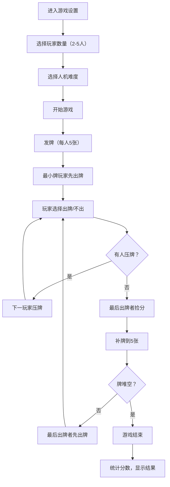

## 1. 产品概述

七王五二三是一款经典的中国民间扑克牌游戏，使用 TypeScript + Vite 技术栈开发，提供单机对战体验。游戏支持 2-5 名玩家（包含玩家本人和 1-4 个人机），玩家可选择人机难度。页面风格参考欢乐斗地主，提供精美的游戏界面和流畅的游戏体验。

## 2. 核心功能

### 2.1 用户角色
| 角色 | 注册方式 | 核心权限 |
|------|----------|----------|
| 玩家 | 无需注册 | 设置游戏参数、出牌、与 AI 对战 |
| 人机 | 系统生成 | 根据难度级别智能出牌、压牌 |

### 2.2 功能模块
1. **游戏设置页面**：玩家数量选择、人机难度选择、开始游戏
2. **游戏主页面**：游戏桌面、玩家手牌、出牌区域、分数统计、游戏状态

### 2.3 页面详情
| 页面名称 | 模块名称 | 功能描述 |
|---------|---------|----------|
| 游戏设置 | 玩家设置 | 选择玩家数量（2-5人）、人机难度（简单/中等/困难） |
| 游戏设置 | 开始按钮 | 确认设置并开始游戏 |
| 游戏主页面 | 游戏桌面 | 显示当前出牌、各玩家位置和状态 |
| 游戏主页面 | 手牌区域 | 显示玩家手牌，支持选择和出牌 |
| 游戏主页面 | 信息面板 | 显示当前分数、轮次、出牌提示 |
| 游戏主页面 | 操作按钮 | 出牌、不出、提示、重新开始 |

## 3. 核心流程

## 4. 用户界面设计

### 4.1 设计风格
- **主色调**：中国红（#C41E3A）+ 金色（#FFD700），营造传统棋牌游戏氛围
- **辅助色**：深绿色牌桌（#1E5631）、深蓝色背景
- **按钮风格**：圆角矩形，金色边框，悬停时有发光效果
- **字体**：使用 Noto Sans SC 作为主字体，数字使用 Roboto Mono
- **布局风格**：圆形牌桌布局，玩家分布在四周，中央为出牌区
- **图标风格**：简洁的线性图标，配合金色点缀

### 4.2 页面设计概览
| 页面名称 | 模块名称 | UI 元素 |
|---------|---------|---------|
| 游戏设置 | 设置面板 | 居中卡片式布局，下拉选择器，金色边框按钮 |
| 游戏主页面 | 牌桌区域 | 深绿色渐变背景，圆形牌桌，金色装饰边框 |
| 游戏主页面 | 手牌区域 | 扇形排列，选中牌上移，悬停放大效果 |
| 游戏主页面 | 玩家头像 | 圆形头像框，显示玩家名称、当前分数、剩余牌数 |
| 游戏主页面 | 操作按钮 | 底部横排排列，圆角金色按钮 |

### 4.3 响应式
- 桌面端优先设计，支持 1280px 以上分辨率
- 中等屏幕（768px-1280px）自适应调整元素大小
- 移动端优化触摸操作，增大按钮点击区域

### 4.4 动画效果
- 发牌动画：牌从牌堆飞出到各玩家手中，带有旋转和弧线
- 出牌动画：牌从玩家手牌区移动到中央出牌区
- 压牌动画：新出牌覆盖在旧牌上，带有阴影和缩放效果
- 捡分动画：分数牌飞入得分玩家区域，数字滚动效果
- 按钮悬停：缩放 + 发光效果
- 获胜动画：金色彩带飘落，获胜玩家高亮显示
