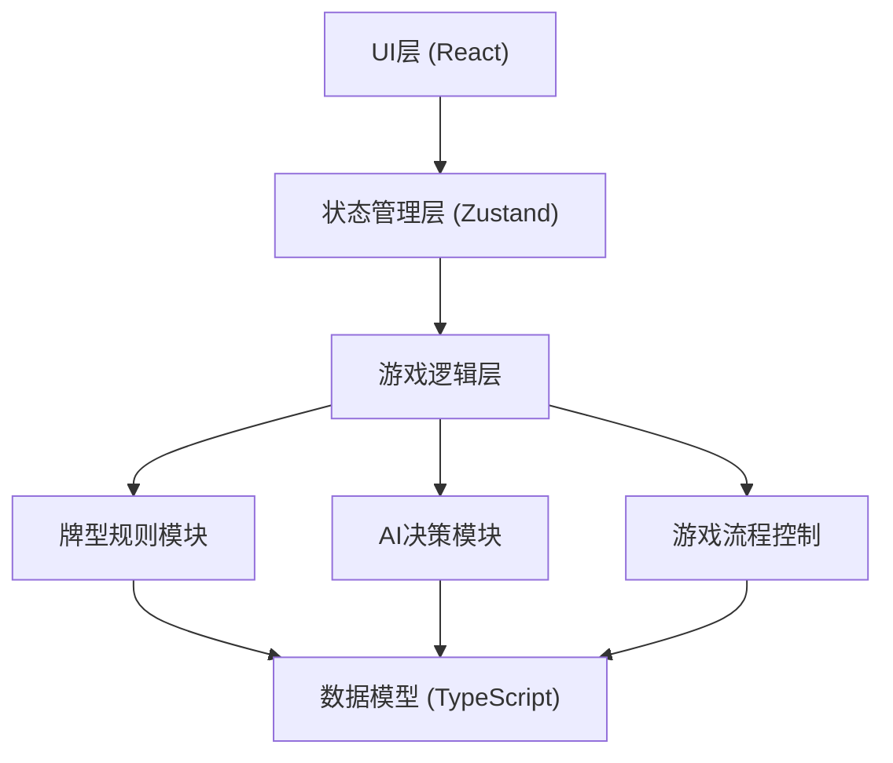

## 1. 架构设计



## 2. 技术描述

- **前端框架**：React 18 + TypeScript 5
- **构建工具**：Vite 5
- **UI 组件库**：Ant Design 5（成熟稳定的组件库）
- **样式方案**：Tailwind CSS 3 + CSS Modules
- **状态管理**：Zustand（轻量级状态管理）
- **动画库**：Framer Motion（流畅的卡牌动画）
- **图标库**：Lucide React

## 3. 路由定义

| 路由 | 用途 |
|------|------|
| / | 游戏设置页面，选择玩家数量和难度 |
| /game | 游戏主页面，进行游戏 |

## 4. 数据模型

### 4.1 核心类型定义

```typescript
// 牌的花色
type Suit = 'spade' | 'heart' | 'club' | 'diamond' | 'joker';

// 牌的点数
type Rank = '7' | 'bigJoker' | 'smallJoker' | '5' | '2' | '3' | 'A' | 'K' | 'Q' | 'J' | '10' | '9' | '8' | '6' | '4';

// 单张牌
interface Card {
  id: string;
  suit: Suit;
  rank: Rank;
  value: number; // 用于比较大小的数值
  suitValue: number; // 花色权重
  isPointCard: boolean;
  points: number; // 5分/10分/0分
}

// 牌型
type CardType = 'single' | 'pair' | 'straight' | 'triple' | 'tripleWithPair' | 'bomb' | 'bombWithSingle';

// 出牌组合
interface Play {
  cards: Card[];
  type: CardType;
  mainRank: Rank; // 主要比较的牌
  highestCard: Card; // 最大的牌（用于比较）
}

// 玩家
interface Player {
  id: string;
  name: string;
  isHuman: boolean;
  cards: Card[];
  score: number;
  position: number; // 桌面位置 0-3
  avatar: string;
}

// 游戏状态
type GamePhase = 'setting' | 'dealing' | 'playing' | 'roundEnd' | 'gameOver';

// 游戏状态Store
interface GameState {
  phase: GamePhase;
  players: Player[];
  currentPlayerIndex: number;
  lastPlay: Play | null;
  lastPlayerIndex: number | null;
  deck: Card[];
  roundCount: number;
  passCount: number;
  difficulty: 'easy' | 'medium' | 'hard';
}
```

### 4.2 牌值权重定义

| 牌 | 权重值 | 说明 |
|----|--------|------|
| 7 | 14 | 最大 |
| 大王 | 13 | |
| 小王 | 12 | |
| 5 | 11 | |
| 2 | 10 | |
| 3 | 9 | |
| A | 8 | |
| K | 7 | |
| Q | 6 | |
| J | 5 | |
| 10 | 4 | |
| 9 | 3 | |
| 8 | 2 | |
| 6 | 1 | |
| 4 | 0 | 最小 |

| 花色 | 权重值 |
|------|--------|
| 黑桃 | 3 |
| 红桃 | 2 |
| 梅花 | 1 |
| 方块 | 0 |

## 5. 核心模块设计

### 5.1 牌型规则模块 (cardRules.ts)

**功能**：
- 判断牌型（单张、对子、顺子、三张、炸弹等）
- 比较两副牌的大小
- 验证出牌是否合法

**核心函数**：
```typescript
function getCardType(cards: Card[]): CardType | null;
function comparePlays(play1: Play, play2: Play): number;
function canBeat(newPlay: Play, lastPlay: Play | null): boolean;
function findAllValidPlays(hand: Card[], lastPlay: Play | null): Play[];
```

### 5.2 AI 决策模块 (aiPlayer.ts)

**功能**：
- 根据难度级别选择出牌策略
- 简单难度：随机选择可出的牌
- 中等难度：优先出小牌，保留大牌
- 困难难度：记牌、算分、最优策略

**核心函数**：
```typescript
function aiChoosePlay(
  hand: Card[],
  lastPlay: Play | null,
  difficulty: Difficulty,
  gameContext: GameContext
): Play | null;
```

### 5.3 游戏流程控制 (gameEngine.ts)

**功能**：
- 初始化游戏、洗牌、发牌
- 处理玩家出牌/不出
- 判定轮次结束、捡分、补牌
- 判定游戏结束

**核心函数**：
```typescript
function initGame(playerCount: number, difficulty: Difficulty): GameState;
function handlePlay(playerIndex: number, play: Play): GameState;
function handlePass(playerIndex: number): GameState;
function endRound(state: GameState): GameState;
function isGameOver(state: GameState): boolean;
```

## 6. 目录结构

```
src/
├── components/
│   ├── GameTable/       # 游戏桌面组件
│   ├── Card/            # 扑克牌组件
│   ├── PlayerHand/      # 玩家手牌组件
│   ├── PlayerInfo/      # 玩家信息组件
│   ├── PlayArea/        # 出牌区域组件
│   └── GameControls/    # 游戏控制按钮
├── pages/
│   ├── SettingPage.tsx  # 设置页面
│   └── GamePage.tsx     # 游戏页面
├── store/
│   └── gameStore.ts     # Zustand 状态管理
├── game/
│   ├── types.ts         # 类型定义
│   ├── cardRules.ts     # 牌型规则
│   ├── aiPlayer.ts      # AI 逻辑
│   ├── gameEngine.ts    # 游戏引擎
│   └── utils.ts         # 工具函数
├── styles/
│   └── globals.css      # 全局样式
├── App.tsx
├── main.tsx
└── router.tsx
```

## 7. 性能优化

- 卡牌组件使用 React.memo 避免不必要重渲染
- 大数组操作使用 Immer 保证不可变更新
- 动画使用 GPU 加速属性（transform, opacity）
- 牌型计算结果缓存，避免重复计算
